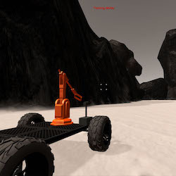
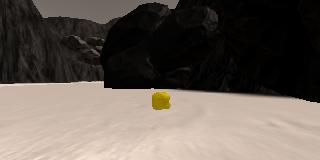
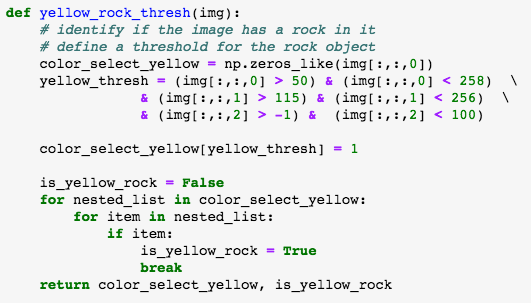
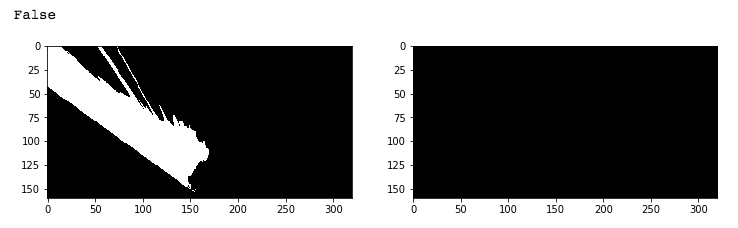
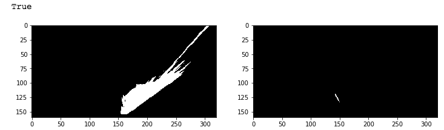
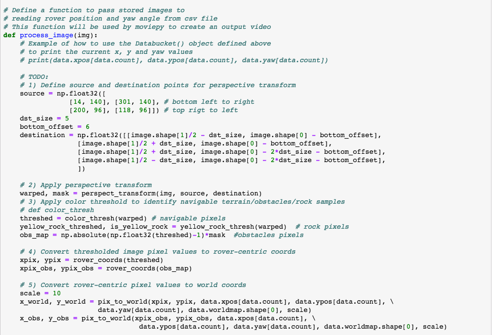
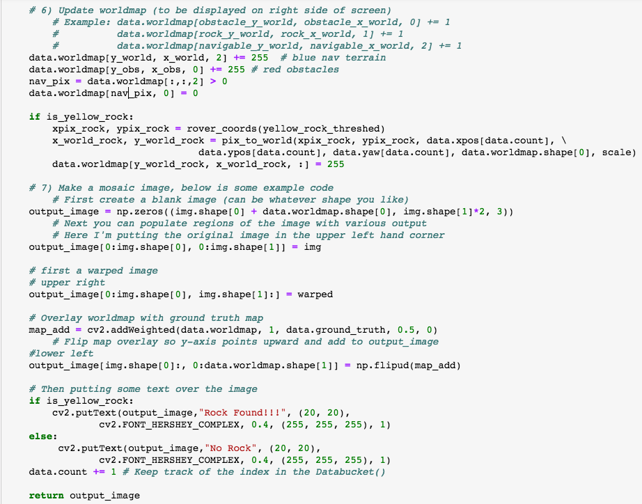
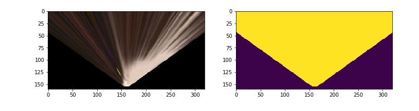

## Project: Search and Sample Return
### James Covino

---

**The goals / steps of this project are the following:**  

**Training / Calibration**  

* Download the simulator and take data in "Training Mode"
* Test out the functions in the Jupyter Notebook provided
* Add functions to detect obstacles and samples of interest (golden rocks)
* Fill in the `process_image()` function with the appropriate image processing steps (perspective transform, color threshold etc.) to get from raw images to a map.  The `output_image` you create in this step should demonstrate that your mapping pipeline works.
* Use `moviepy` to process the images in your saved dataset with the `process_image()` function.  Include the video you produce as part of your submission.

**Autonomous Navigation / Mapping**

* Fill in the `perception_step()` function within the `perception.py` script with the appropriate image processing functions to create a map and update `Rover()` data (similar to what you did with `process_image()` in the notebook). 
* Fill in the `decision_step()` function within the `decision.py` script with conditional statements that take into consideration the outputs of the `perception_step()` in deciding how to issue throttle, brake and steering commands. 
* Iterate on your perception and decision function until your rover does a reasonable (need to define metric) job of navigating and mapping.  

[//]: # (Image References)

## [Rubric](https://review.udacity.com/#!/rubrics/916/view) Points
### Here I will consider the rubric points individually and describe how I addressed each point in my implementation.  

---
### Writeup / README

#### 1. Provide a Writeup / README that includes all the rubric points and how you addressed each one.  You can submit your writeup as markdown or pdf.  
See below

### Notebook Analysis
#### 1. Run the functions provided in the notebook on test images (first with the test data provided, next on data you have recorded). Add/modify functions to allow for color selection of obstacles and rock samples.
A yellow_rock_thresholding function was added, as illustrated in image 4 below. The threshold setting for the yellow rock was arrived at with empirical testing. The function returns the binary threshold image, and a binary variable indicating if a rock was found.  Image 5 and Image 6 below illustrate the results of the function when passed a non-rock image and a rock image respectively.

Image 4

Image 5

Image 6

#### 1. Populate the `process_image()` function with the appropriate analysis steps to map pixels identifying navigable terrain, obstacles and rock samples into a worldmap.  Run `process_image()` on your test data using the `moviepy` functions provided to create video output of your result. 
The Movie image is stored in the github folder './submission_images'
The updated process_image function can be seen in ipython notebook or python file saved in this github repository
Additionally, the process_image function is included in the images below

Image 7

Image 8

### Autonomous Navigation and Mapping

#### 1. Fill in the `perception_step()` (at the bottom of the `perception.py` script) and `decision_step()` (in `decision.py`) functions in the autonomous mapping scripts and an explanation is provided in the writeup of how and why these functions were modified as they were.

#### 2. Launching in autonomous mode your rover can navigate and map autonomously.  Explain your results and how you might improve them in your writeup.  

**Note: running the simulator with different choices of resolution and graphics quality may produce different results, particularly on different machines!  Make a note of your simulator settings (resolution and graphics quality set on launch) and frames per second (FPS output to terminal by `drive_rover.py`) in your writeup when you submit the project so your reviewer can reproduce your results.**

#### Setup:
I had to run RoverSim on a linux virtual machine given the 'untrusted developer' status from RoverSim and my strict security settings. I ran the RoverSim application at 640 x 480, windowed with Graphics Quality set to Fastest.  This still resulted in choppy RoverSim performance, but I was able to get the feedback needed to modify the existing code.

#### Approach:

##### Finding the Yellow Rocks:
Finding the yellow rocks was done with thresholding.  After empirical testing in the ipython notebook, settings were found
that could correctly identify the presence or absence of the rocks with 100% accuracy given the provided the test images.
See Image 4,5 and 6 above.

##### Drivable Terrain & Obstacles:
 A perspective transform of the incoming image was used to identify the terrain.  The warped image and the mask are shown in the image below.  The warped image is used to identify the drivable terrain pixels, the masked image is used to identify the obstacle pixels, and the yellow rock warped image (not shown) is used to identify the rock pixels.
I did get stuck with finding the obstacles and implementing the mask. I used the code provided in the Udacity youtube video to solve the masking problem.

Image 9

The code used to identify the pixels following the perspective transform is shown below. 

3) Apply color threshold to identify navigable terrain/obstacles/rock samples
    threshed = color_thresh(warped) # navigable pixels
    yellow_rock_threshed, is_yellow_rock = yellow_rock_thresh(warped)  # rock pixels
    obs_map = np.absolute(np.float32(threshed)-1)*mask  #obstacles pixels

The other perception functionality was carried over from the lessons provided. Overall, the perception function is simplistic and needs modifications to improve the fidelity of the mapping.

##### Rover getting stuck:
###### I. Stuck in a driving loop
After significant testing, it was found that the Rover would sometimes get into a driving circle loop (upper right side of map) in an area that was a wide opening with multiple branching paths. In the decision matrix, the Navigable terrain was continuously favored in the open wide area over the smaller paths. This resulted in the rover circling indefinitely.
I implemented a very crude solution to break this cycle of infinite looping.  The looping always seemed to occur with a constant steer angle, and ultimately resulted in no changes to the %mapped variable.
I added variables to the Rover class to track the last setting of the steer angle, the current percent mapped, and a counter variable.
If the Rover was moving, its steer angle and percent mapped remained unchanged; the counter was incremented. After a counter variable threshold was reached the Rover's steering was adjusted to 0, and velocity was increased for a few frames to try to break the loop.
The trick with this basic technique is false positives, in which the Rover is not really in a driving loop but the 'break the loop' code is implemented. This was prevented with adjustments to the counter variable threshold, and resetting the counter variable when conditions were not met.

###### II. Stuck behind an object with no movement
Despite the identification of drivable and un-drivable terrain, the Rover could sometimes find itself stuck behind a clump of rocks indefinitely.  This also happened frequently when taking the wheel manually and then switching back to auto mode.
To remedy this problem a simple solution similar to the driving loop problem was implemented. A counter variable was added to the Rover class to track if the Rover was stuck. If the Rover's velocity was below 0.2 then the counter was incremented.  Once a threshold of the counter variable was surpassed the Rover was reversed for a few frames and then re-zeroed. As seen with the driving loop problem the trick with this basic technique is false positives This was prevented with adjustments to the counter variable threshold, and resetting the counter variable once the Rover was moving again.

#### Improvements and Future work
I will continue to spend more time the Rover problem.  I was delayed with this project with issues getting RoverSim to run on my mac in 'big brother mode' with a an 'untrusted application'. Now that it's up and running, it's a rewarding feedback driven project.

Future Work:
Impelementing a more elegant solution to the stuck in a driving loop problem:
Track the coordinates traveled by the Rover. If the Rover repeats the same coordinates/path over and over again, then implement the loop driving breaking technique or force a new coordinate.

Implementing Rover map awareness:
Where has it been. The data is available, but just needs to be stored in a manner that can provide quick look up. If the Rover knows where it has been and how those coordinates are linked together (Graph) then the rover can make decisions about travelling down the same old path or a new one.

Implementing picking up the rocks - Autopilot functionality:
If the rock coordinates are identified then I can direct the Rover to move to those coordinates and pick up the rock. Similarly, if I know the coordinates of any destination on the map, I can direct the Rover to that spot.  Controlling the steering, speed, and accuracy of Rock, as well as the Rover/Map positioning I see as the major challenges. I also foresee infinite loop problems where the Rover could get stuck trying to approach and pickup the rock. 

Improving Mapping fidelity:
Spend more time improving the perception function to improve mapping fidelity/accuracy.

